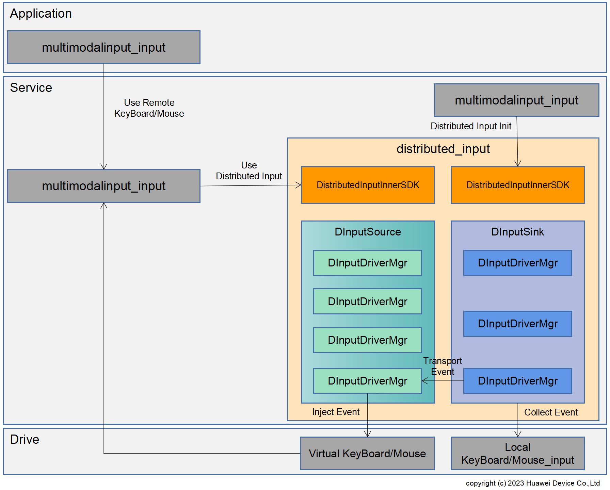

# **分布式输入部件**

## **简介**

分布式输入提供了跨设备的输入外设控制能力，使一台设备可以使用另一台设备的输入外设（如鼠标，键盘，触摸板等）在本设备进行输入操作（如鼠标点击，键盘打字，触摸板滑动等），对端设备的外设输入事件在本机生效。  
分布式输入不提供北向接口，由[多模输入子系统](https://gitee.com/openharmony/multimodalinput_input)提供[分布式输入业务接口](https://gitee.com/openharmony/interface_sdk-js/blob/master/api/@ohos.multimodalInput.inputDeviceCooperate.d.ts)供开发者调用分布式输入的能力。

### **概念说明**

**主控端(source)**：分布式输入控制端设备，向被控端设备发送指令，使用其外设输入的能力。

**被控端(sink)**：分布式输入被控制端设备，接受主控端发送的指令并且完成对应操作，提供本地外设供主控端设备使用。

### **架构实现**

系统架构图如下所示：



**分布式输入主控端(DInputSource)**：使用周边设备输入外设的设备，称为分布式输入主控端，周边设备输入外设输入事件可以在主控端生效。

**分布式输入被控端(DInputSink)**：提供本地输入外设供主控端设备使用的设备，称为分布式输入被控端，输入外设连接在分布式输入被控端。

**分布式输入InnerSDK(DistributedInputSDK)**：为多模输入模块调用分布式输入能力提供的内部接口。

**分布式输入硬件框架南向扩展实现(DistributedInputFwkImpl)**：实现了[分布式硬件管理框架](https://gitee.com/openharmony/distributedhardware_distributed_hardware_fwk)定义的南向外设扩展接口，供分布式硬件管理框架调度分布式输入能力。

**分布式输入驱动管理(DInputDriverMgr)**：提供分布式输入驱动的添加和删除能力。

**事件过滤(EventFilter)**：提供组合键过滤能力，根据系统预置的组合键白名单进行组合键过滤，白名单上的组合键只在被控端设备生效，比如锁屏键等。

**事件采集(EventCollector)**：用于从输入驱动采集输入外设原始事件。

**事件发送(EventSender)**：用于将事件采集模块采集到的原始事件发送到主控端。

**事件接收(EventReceiver)**：用于接收被控端事件发送模块发送的输入外设原始事件。

**事件注入(EventInject)**：用于将被控端发送的输入外设原始事件注入虚拟输入驱动。

**本地输入驱动(Local Input Driver)**：被控端输入外设在驱动层对应的驱动节点。

**虚拟输入驱动(Virtual Input Driver)**：被控端输入外设的硬件规格信息通过分布式硬件管理框架同步信息到主控端后，主控端分布式硬件管理框架调用分布式输入虚拟驱动注册功能，在主控端为对应的被控端输入外设创建的虚拟输入驱动节点，和被控端输入驱动节点对应。

### **流程说明**

#### **1. 设备上线**

设备组网并认证通过后，会触发设备上线事件，[设备管理](https://gitee.com/openharmony/distributedhardware_device_manager)发现设备上线后，启动分布式硬件管理框架，分布式硬件管理框架启动完成后，会进行本地输入外设的信息查询和跨设备同步，同时进行分布式输入主控端和被控端模块的初始化。

#### **2. 分布式输入驱动的准备**

分布式硬件管理框架同步到被控端设备的输入外设硬件规格信息后，会调用分布式输入驱动注册接口，为被控端设备输入外设在主控端设备注册对应的外设虚拟驱动节点，作为被控端设备外设的代理，该代理会被多模输入自动发现并和本地输入外设一起管理起来。

#### **3. 使用分布式输入能力**

(1) 应用可以调用多模输入的“键鼠穿越功能开关”接口，打开键鼠穿越功能开关，开关打开后，应用可以调用下述“开始穿越”和“停止穿越”接口，控制被控端输入外设生效的设备。

(2) 应用可以调用多模输入的“开始穿越”接口，启动键鼠外设的跨设备输入能力，此时被控端输入外设（键盘，鼠标，触摸板等）产生的输入事件可以在主控端生效。

(3) 应用可以调用多模输入的“停止穿越”接口，停止键鼠外设的跨设备输入能力，此时被控端输入外设（键盘，鼠标，触摸板等）产生的输入事件在本地生效，不再控制主控端。

备注：关于多模输入分布式输入相关接口的使用，参见[多模输入相关文档](https://gitee.com/openharmony/interface_sdk-js/blob/master/api/@ohos.multimodalInput.inputDeviceCooperate.d.ts)。

#### **4. 设备下线**

设备下线后，分布式硬件管理框架去使能下线设备的输入外设，移除下线设备输入外设对应的虚拟输入驱动，两个设备之间不再拥有分布式输入能力。

## **目录**

```
/foundation/distributedhardware/distributed_input
├── common                                  # 分布式输入常量定义和公共函数
├── dfx_utils                               # 分布式输入实现DFX业务的相关实现
├── frameworks                              # 分布式输入innerkit接口使用到的回调函数定义
├── inputdevicehandler                      # 分布式输入实现分布式硬件管理框架定义的能力查询接口实现
├── interfaces                              # 分布式输入实现对外接口模块
├── low_latency                             # 分布式输入实现输入事件跨设备低时延传输能力业务
├── sa_profile                              # 分布式输入的SA配置信息
├── services                                # 分布式输入的SA具体实现
│   └── common                              # 分布式输入实现用到的公共常量定义
│   └── sink                                # 分布式输入的sink侧SA实现
│   │   ├── inputcollector                  # 分布式输入的输入驱动原始事件获取
│   │   ├── sinkmanager                     # 分布式输入sink侧业务管理，响应主控端相关业务调用
│   │   └── transport                       # 分布式输入sink侧事件发送
│   └── source                              # 分布式输入的source侧SA实现
│   |   ├── inputinject                     # 分布式输入的原始事件注入
│   |   ├── sourcemanager                   # 分布式输入的source侧业务管理，实现外部相关接口
│   |   └── transport                       # 分布式输入source侧事件接收
|   └── transportbase                       # 分布式输入的驱动事件数据传输接口
├── sinkhandler                             # 分布式输入实现的分布式硬件管理框架定义的sink侧部件接入接口
├── sourcehandler                           # 分布式输入实现的分布式硬件管理框架定义的source侧部件接入接口
└── test                                    # 分布式输入fuzz测试的实现
├── utils                                   # 分布式输入工具类的实现
```

## **约束**

**语言限制**：C++语言。

**组网环境**：必须确保设备在同一个局域网中。

**操作系统限制**：OpenHarmony标准操作系统。

## **相关仓**

****

**分布式硬件子系统：**

设备管理
[device_manager](https://gitee.com/openharmony/distributedhardware_device_manager)

分步式硬件管理框架
[distributed_hardware_fwk](https://gitee.com/openharmony/distributedhardware_distributed_hardware_fwk)

分布式相机
[distributed_camera](https://gitee.com/openharmony/distributedhardware_distributed_camera)

分布式屏幕
[distributed_screen](https://gitee.com/openharmony/distributedhardware_distributed_screen)

分布式音频
[distributed_audio](https://gitee.com/openharmony/distributedhardware_distributed_audio)

**分布式输入
[distributed_input](https://gitee.com/openharmony/distributedhardware_distributed_input)**
